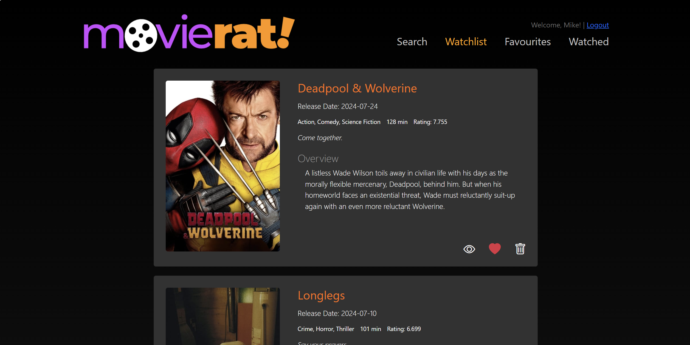

# MovieRat

MovieRat is a web application where users can discover, manage, and track movies. Users can explore trending and in-theater movies, add them to their watchlist, favorites, or mark them as watched. The app also allows users to search for movies and curate their collections.

This project uses Rails for the backend, with PostgreSQL as the database, and React for the frontend.

## Features

- **Trending and In-Theater Movies**: Users can view lists of trending and currently in-theater movies.
- **Movie Management**: Add movies to your watchlist, favorites, or watched section.
- **Search Functionality**: Search for movies and add them to your watchlist.
- **User Authentication**: Secure login system, allowing users to have personalized movie lists.

## Screenshots Of MovieRat

  

  

  

  

  

## Technologies Used

- **Backend**: Ruby on Rails, PostgreSQL
- **Frontend**: React, JavaScript, HTML, CSS

## Prerequisites

Ensure you have the following software installed:

- **Ruby** (version 2.7 or higher)
- **Rails** (version 6 or higher)
- **PostgreSQL** (version 10 or higher)
- **Node.js** (version 12 or higher)
- **npm**

## Getting Started

### 1. Fork and Clone the Repository

- Fork the repository to get your own copy of it.
- Clone the forked repo to your local machine:

    \`\`\`bash
    git clone https://github.com/your-username/movierat.git
    \`\`\`

    \`\`\`bash
    cd movierat
    \`\`\`

### 2. Backend Setup (Rails API)

- Open a terminal in the project’s root directory.
- Install the backend dependencies:

    \`\`\`bash
    bundle install
    \`\`\`

- **Database Setup**: Create and set up the database. This will create the necessary tables and seed any initial data:

    \`\`\`bash
    bin/rake db:setup
    \`\`\`

    If you prefer breaking it into individual commands:
    
    \`\`\`bash
    bin/rails db:create   # Creates the PostgreSQL database
    bin/rails db:migrate  # Runs migrations and creates tables
    bin/rails db:seed     # Seeds the database (optional)
    \`\`\`

- Start the Rails server:

    \`\`\`bash
    bin/rails s
    \`\`\`

### 3. Frontend Setup (React)

- Open a new terminal and \`cd\` into the \`client\` directory:

    \`\`\`bash
    cd client
    \`\`\`

- Install the frontend dependencies:

    \`\`\`bash
    npm install
    \`\`\`

- Rename the \`.env.example\` file to \`.env\` and configure the environment variables as necessary.

- Start the React development server:

    \`\`\`bash
    npm start
    \`\`\`

### 4. Access the Application

- Open your browser and navigate to:

    \`\`\`
    http://localhost:3000
    \`\`\`

You should now see the MovieRat landing page with trending movies listed.

### 5. PostgreSQL Management

Ensure PostgreSQL is running before attempting to create or access the database. If PostgreSQL is not running, start it with:

\`\`\`
sudo service postgresql start
\`\`\`

## Additional Information

- The \`.env\` file in the \`client\` folder holds environment variables necessary for the frontend React app to run properly.

## If you want to use this project and make changes/ features of your own and then deploy to Heroku, follow the following steps

MovieRat is all set up to deal with deploying to Heroku. If you have the Heroku CLI tools installed you can run `heroku create` to create the Heroku project.

Then we must run two commands to tell Heroku to first build our React app, and _then_ build the Rails app.

1. `heroku buildpacks:add heroku/nodejs --index 1`
2. `heroku buildpacks:add heroku/ruby --index 2`

Once you've done that, you can run `git push heroku master` to deploy your project any time you want! Note, however, that deploying to Heroku can be a _little_ slow since Heroku needs to build your React app. Just give it some time.

Once it's deployed, you can run the following commands to manage your app:

- `heroku run rake db:schema:load` to set up your database the first time
- `heroku run rake db:migrate` for any additional migrations
- `heroku run rake db:seed` for seeds
- `heroku run rake db:rollback` to rollback a migration

There are other commands, but these are good to get you started!

To make your app work properly with React Router (if you end up using it) on Heroku, I've added a special route to the `routes.rb` file (`get '*path' ... `).
